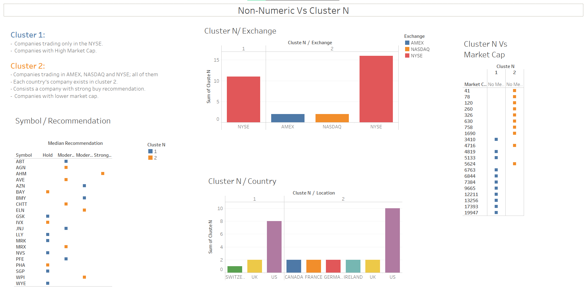

# Pharmaceuticals Industry
>An equities analyst is studying the pharmaceutical industry and would like your help in exploring and understanding the financial data collected by her firm. Her main objective is to understand the structure of the pharmaceutical industry using some basic financial measures. \n
Financial data gathered on 21 firms in the pharmaceutical industry are available in the file Pharmaceuticals.csv. For each firm, the following variables are recorded: \n


```{r setup, include=FALSE, warning=FALSE, include=FALSE}
library(readr)
setwd("~/R_KSU/ML/Assignment4")
Ph.data <- read_csv("Pharmaceuticals.csv")
library(tidyverse)
library(data.table)
```

## Data Overview
```{r}
str(Ph.data)
```
> Kmeans clustering is only done with variables having continuous data. Hece variables - 'symbol', 'Name', 'Median_Recommendation', 'Location', 'Exchange' will be droped from further analytic steps

## Data cleaning
```{r}
summary(Ph.data)
```
Checking missing values
```{r}
colSums(is.na(Ph.data))
```

### Analyzing outliers for every variable before normalizing the variable, Outliers should not be taken for granted. As in our problem extreme points of some of the variables may be the triggers of a sell off or buy of a paticular stock, which if missed may lead to an unrecoveranle opportunity cost.
```{r}
#normalizing data to fit all variables in the same graph
# Scaling the data frame (z-score) 
data <- data.frame(scale(Ph.data[,3:11]))

boxplot(data, col=c("red","blue","green", "Orange","yellow", "Purple", "grey" ))
```
>> There are 8 outlier points over 9 variables of the pharmaceutical data. While selecting the optimized K value for implementing K-means algorithm. We will need to remove these outliered points before evaluating the optimized k value.

```{r}
library(factoextra)
v_name <- Ph.data[,1]
row.names(data) <- unlist(v_name) #Adding rownames from the original dataset as identifiers
distance <- get_dist(data,"euclidean")
fviz_dist(distance,
  order = TRUE,
  show_labels = TRUE,
  lab_size = NULL,
  gradient = list(low = "red", mid = "white", high = "blue"))
```

### Determining k 
>> Before determining k we need a dataframe containing data without the outliers

```{r}
# Function to detect all outliers from the numerical variable data
an <- function(x){
q1 <- quantile(data[,x],0.25)
q3 <- quantile(data[,x],0.75)
iqr <- q3 -q1 
lower <- q1-1.5*iqr
upper <- q3+1.5*iqr
data[x][(data[x]<lower) | (data[x]>upper), ]
}


dummy <- vector('list',length = length(data))
for(i in seq_along(data)){
  dummy[[i]] <- an(names(data)[i])
}
names(dummy) <- names(data)

temp_data <- data %>% filter(Market_Cap != dummy[[1]], Beta != dummy[[2]], !(PE_Ratio %in% dummy[[3]]),
                ROE != dummy[[4]], !(Leverage %in% dummy[[6]]))
```

> List of all points from each variable resulting outliers are filtered out from the source data and saved into a temporary data; temp_data. Which is further used in the Elbow method, silhoute method and gap-static method to measure the optimized value of K

```{r}
library(factoextra)

# Elbow method
fviz_nbclust(temp_data, kmeans, method = "wss") +
  geom_vline(xintercept = 2, linetype = 2)+
  labs(subtitle = "Elbow method")

```

```{r}
# Silhouette method
fviz_nbclust(temp_data, kmeans, method = "silhouette")+
  labs(subtitle = "Silhouette method")
```

```{r}
set.seed(123)
fviz_nbclust(temp_data, kmeans, nstart = 25,  method = "gap_stat", nboot = 50)+
  labs(subtitle = "Gap statistic method")
```
> We can conclude that the values of K can be 2 or 1. We will consider k-value to be 2 and continue with generating clusters with kmeans modelling technique.

```{r}
ph.cluster2 <- kmeans(data, 2, 25)
ph.cluster2

```
```{r}
# Visualize the output
ph.cluster2$centers            # output the centers
```

```{r}

ph.cluster2$size               # Number of companies in each cluster
```

```{r}
ph.cluster2$cluster            # Identify the cluster of all observation
```
```{r}
cls <- data.frame(ph.cluster2$cluster)
clsdf <- setDT(cls, keep.rownames = TRUE)[]
colnames(clsdf) <- c("rn", "clusteN")
barplot(table(clsdf$clusteN), main="Cluster Distribution", xlab="ClusterNo", ylab="Cout")
```

```{r}
library(factoextra)

ph.cluster2$cluster

fviz_cluster(ph.cluster2, data, ellipse.type = "norm", geom = "text" ,
             palette = "Set2", ggtheme = theme_minimal())
```

```{r}
fviz_cluster(ph.cluster2, data, 
             palette = "Set2", ggtheme = theme_minimal(), geom = "text" )
```


```{r}
head(Ph.data)

datadf <- setDT(Ph.data, keep.rownames = TRUE)[]
#cl.data <- datadf %>% merge(datadf, clsdf, by="rn", all = TRUE)
cl.data <- cbind(datadf, clsdf)
result <- cl.data[,-c(1,16)]
result
```
```{r}
#writing the result file.
write_csv2(result,file="result.csv" )
```

```{r}
#library(GGally)

#ggparcoord(result2,
#    columns = 1:9, groupColumn = 10
#    ) 
```

```{r}

```

